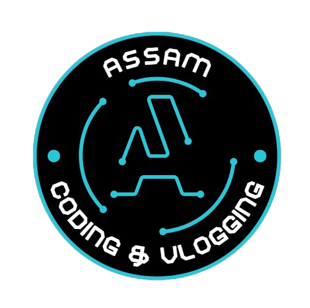

# Slideshow
Welcome to the **Slideshow** repository! This project demonstrates interactive and visually appealing web components built with **HTML**, **CSS**, and **JavaScript**.

  

## Table of Contents
1. Dynamic Slideshow
   - Clickable
   - Automatic
   - HTML, CSS & JS used
   - Completely Customised
     
3. Expandable Cards using HTML, CSS & JS
   - Clickable
   - HTML, CSS & JS used
   - Completely Customised

---

Feel free to explore the repository and experiment with these interactive components!

---

# SUBSCRIBE [Assam Coding & Vlogging](https://www.youtube.com/@AssamCodingVlogging) for more contents like this

---
## Thank You
